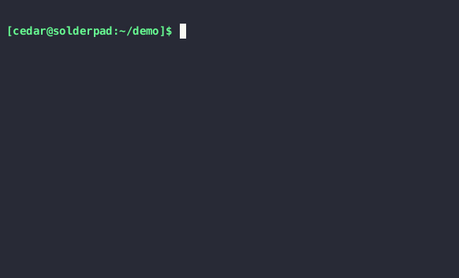

# Demo

[](https://www.youtube.com/watch?v=W1ValKNYw_U)


# ChatSH: a Minimalist LLM Shell

ChatSH is a command-line tool powered by Claude, designed for syntax-highlighted bash productivity.

Note: This contains an anthropic api key for you to try it. It's limited to $5 a month so please don't abuse it.

## Features
- Interactive LLM-powered bash REPL
- Syntax highlighting for improved readability

## Installation

Use [Poetry](https://python-poetry.org/) to install the dependencies:

```bash
poetry install
```

## Usage

Run the tool using:

```bash
chatsh
```

A loaner token is included for the default anthropic chat. It is heavily rate limited so please replace it with your own token ASAP. Write your anthorpic token as a text file to `~/anthropic.token`.

## License
This project is licensed under the MIT License.

## Thanks
Victor Tailin. This project is inspired by his [chatsh.mjs](https://web.archive.org/web/20240000000000*/https://github.com/VictorTaelin/AI-scripts/blob/main/chatsh.mjs). 

## FAQ

#### What's your trick?
The trick is a nice prompt with some good examples.
